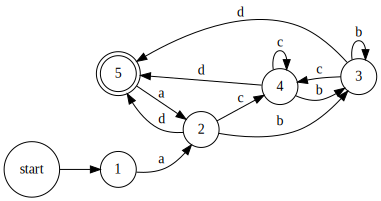

# Regex Engine in Python

This Regex Engine is a custom implementation of regular expression matching, providing an in-depth exploration of how regex engines work under the hood. This project is a comprehensive Python package that tokenizes regex patterns, builds an abstract syntax tree (AST), constructs a non-deterministic finite automaton (NFA) from the AST, and then optimizes it into a deterministic finite automaton (DFA). The engine supports a variety of regex features, making it a versatile tool for pattern matching.

## Key Components

- `token.py`: Parses regex patterns into tokens, supporting literals, groups, classes, quantifiers, etc.
- `ast.py`: Constructs an abstract syntax tree (AST) from the tokens.
- `nfa.py`: Builds an NFA from the AST, capable of matching strings and generating DOT visualizations for debugging.
- `dfa.py`: Converts the NFA to a DFA using epsilon closure for optimization. The DFA can match strings and generate DOT visualizations.
- `regex.py`: Provides a high-level interface to compile regex patterns into DFA for efficient matching.

## Why This Approach?

The conversion from regex to NFA and then to DFA is a classic approach in regex engines due to its robustness and efficiency.

- **Flexibility and Power of NFAs**: NFAs are a natural fit for regex patterns, easily handling features like quantifiers, alternations, and groups.
- **Efficiency of DFAs**: While NFAs are powerful, DFAs offer greater efficiency in matching. A DFA, for each input state and character, has exactly one output state, leading to faster and more predictable performance.
- **Optimization**: The conversion from NFA to DFA, while computationally intensive, is a one-time cost. The resulting DFA is optimized for quick matching, making it faster for repeated use.

## Visualization of the Regex Process

### Example: From NFA to DFA

The Regex Engine not only matches patterns but also provides visual insights into how these patterns are processed. Below is an example showing the transformation from NFA to DFA for a regex pattern.

#### NFA for Pattern `(a[bc]*d)+`

Here's the visualization of the NFA for the pattern `(a[bc]*d)+`:


The NFA captures all possible paths the regex engine might take to match the pattern.

#### Simplified DFA

The NFA is then converted to a more efficient DFA:



The DFA simplifies the matching process, with each state having a deterministic transition for each input character.

### Visualization Conclusion

These visualizations demonstrate the engine's capability to not only match patterns but also to optimize and simplify the process, ensuring efficient and reliable performance.

## Usage

## High-Level Interface

```python
from src.regex import match

print("Example usage:")
print(f"{match('a(b|c)*d', 'abccbd')=}")
print(f"{match('a(b|c)*d', 'abccbde')=}")
print("It works!")
```

## Compiling Patterns for Efficiency

For repeated matching, compile the pattern once and reuse the DFA:

```python
from src.regex import compile

compiled = compile('a(b|c)*d')
print(f"{compiled.match('abccbd')=}")
print(f"{compiled.match('abccbde')=}")
```

This approach significantly speeds up matching, especially when the same pattern is used multiple times.

## Conclusion

This Regex Engine provides a clear illustration of the regex parsing and matching process, suitable for educational purposes and practical applications. By compiling patterns into optimized DFAs, it achieves high efficiency in pattern matching, especially useful for applications requiring frequent use of the same pattern.
